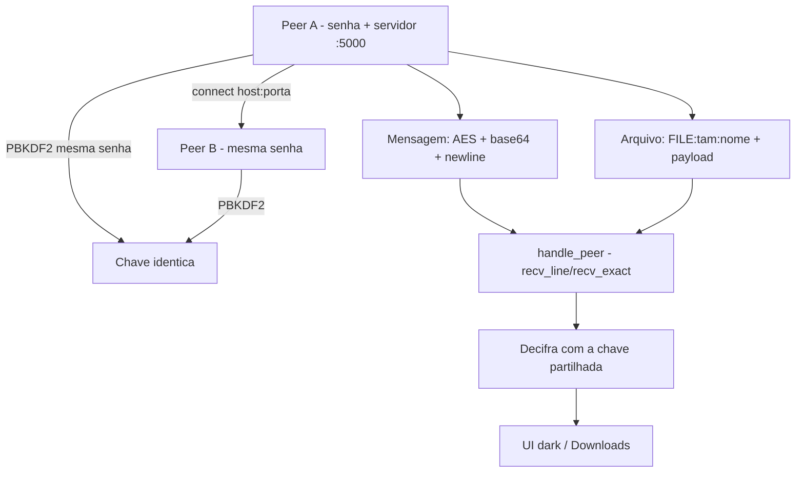

# 🔒 SecureChat-P2P — Chat Peer-to-Peer Criptografado
<p align="center">
  
  <a href="https://github.com/panda12332145/SecureChat-P2P/commits/main"></a>
  <a href="https://github.com/panda12332145/SecureChat-P2P"></a>
  
</p>
---
> ⚠️ **Privacidade:** garanta que **ambas as partes consentem** na comunicação. Os dois lados devem usar a **mesma senha pré-compartilhada** — sem ela, não há como decifrar (por design).

---
## 🔖 Resumo

Chat **peer-to-peer sem servidor central**: mensagens e arquivos trafegam cifrados com **AES-256** e chave derivada por **PBKDF2-SHA256 (100k iterações)** a partir de uma senha compartilhada. Interface Tkinter dark com conexão flexível (botão *Conectar*), protocolo de linha imune a fragmentação de TCP e salvamento seguro de arquivos recebidos.

### ✨ Funcionalidades Principais

- ✅ E2E: só os dois lados com a senha têm a chave (AES-256, IV aleatório por pacote)
- ✅ Protocolo de linha com tamanho explícito — arquivos de qualquer tamanho sem travar
- ✅ Proteção contra path traversal no nome de arquivos recebidos (basename)
- ✅ Servidor sempre ativo: conecte depois pelo botão Conectar (host:porta)
- ✅ Transferência de arquivos cifrada + mensagens com nome de usuário
- ✅ Tema escuro, sem dependência de servidor

## 📽 Demonstração

```text
# Máquina A:
$ python main.py --name Ana --password 'nossa-senha' --port 5000
[servidor escutando na porta 5000]

# Máquina B:
$ python main.py --name Bruno --password 'nossa-senha' --port 5001 --peer 192.168.0.10:5000
[conectado a 192.168.0.10:5000]

# Agora: mensagens e arquivos trafegam cifrados nos dois sentidos
```

## ⚙️ Explicação das Partes Importantes

### Acordo de chave (`src/crypto.py`)

```python
DEFAULT_SALT = b"SecureChatP2P-v1"   # fixo e público de propósito
def derive_key(password, salt=DEFAULT_SALT):
    kdf = PBKDF2HMAC(algorithm=hashes.SHA256(), length=32,
                     salt=salt, iterations=100_000)
    return kdf.derive(password.encode())
```

> Salt fixo = os dois lados derivam **exatamente a mesma chave** da senha compartilhada (padrão PSK). O erro clássico — salt aleatório por processo — gerava chaves diferentes em cada ponta e tornava o chat impossível.

### Protocolo de linha (`src/network.py`)

```python
# mensagem: <base64 cifrado>\n
# arquivo:  FILE:<tamanho>:<nome>\n<tamanho bytes>
line = _recv_line(sock, buf)        # imune a fragmentação do TCP
payload = _recv_exact(sock, buf, n) # tamanho explícito = sem travar
```

> O delimitador \n é seguro porque base64 nunca contém quebra de linha; o tamanho no cabeçalho elimina a ambiguidade 'até quando ler' que travava transferências múltiplas do buffer.

### Recebimento seguro (`handle_peer`)

```python
safe_name = os.path.basename(name)  # bloqueia ../../etc/passwd
out_path = os.path.join(save_dir, safe_name)
```

> Nome recebido sempre reduzido ao basename antes de gravar em `~/Downloads`.

## 🔄 Fluxo de Trabalho / Arquitetura



## 📂 Estrutura do Projeto

```plaintext
SecureChat-P2P/
├── main.py               # CLI: nome, senha, peer, porta, --no-gui
├── src/
│   ├── crypto.py         # PBKDF2 + AES-256 (mensagem e arquivo)
│   ├── network.py        # framing, servidor, envio/recebimento
│   └── chat_ui.py        # interface Tkinter dark
├── tests/test_securechat.py  # 5 testes (sem GUI)
├── requirements.txt
└── README.md
```

## 🛠️ Tecnologias

| Ferramenta | Uso |
|---|---|
| **Python 3** | Linguagem |
| **cryptography** | AES-256 + PBKDF2-SHA256 |
| **sockets TCP** | Transporte P2P |
| **Tkinter** | Interface gráfica |

## ▶️ Instalação

```bash
git clone https://github.com/panda12332145/SecureChat-P2P.git
cd SecureChat-P2P
pip install -r requirements.txt
```

## 🚀 Execução

```bash
# Peer A (inicia primeiro, porta 5000):
python main.py --name Ana --password 'mesma-senha'

# Peer B (conecta ao A):
python main.py --name Bruno --password 'mesma-senha' \
  --port 5001 --peer IP_DA_MAQUINA_A:5000

# Sem display (só recepção, p/ servidores):
python main.py --name Serv --password 'x' --no-gui

# Testes:
python tests/test_securechat.py
```

## 🧪 Testes

5 testes automatizados: igualdade de chaves, roundtrip de mensagem, arquivo de 8192 bytes (múltiplo exato do buffer), framing completo por socketpair e bloqueio de path traversal.

## ⚠️ Limitações

- Os dois lados precisam da mesma senha (não há troca de chaves/curva Diffie-Hellman ainda)
- A senha trafega como pré-compartilhada — combine um canal seguro para distribuí-la
- Uma instância por porta (2 máquinas na mesma rede local precisam de portas diferentes)

## 🚀 Roadmap

- [ ] Troca de chaves ECDH (eliminar senha estática)
- [ ] Autenticação de integridade (HMAC)
- [ ] Notificação sonora de mensagens
- [ ] Modo CLI simples para terminais

## 📄 Licença

Todos os direitos reservados ao autor.

---

## 👾 Autor

<p align="center">
  
</p>

<p align="center">Feito por <strong>Panda12332145</strong> 👋🏽</p>

---

## 🧑‍💻 Sobre Mim

Sou apaixonado por **Física Teórica, Cibersegurança e Desenvolvimento de Sistemas**. Tenho grande interesse em programação de baixo nível, engenharia reversa, automação, sistemas Windows, criptografia e segurança ofensiva. Também gosto bastante de música, filosofia e computação avançada.

---

## 🌐 Redes

* **Site:** [https://panda-h0me.netlify.app/](https://panda-h0me.netlify.app/)
* **YouTube:** [https://www.youtube.com/@X86BinaryGhost](https://www.youtube.com/@X86BinaryGhost)
* **Instagram:** [https://www.instagram.com/01pandal10/](https://www.instagram.com/01pandal10/)
* **GitHub:** [https://github.com/panda12332145](https://github.com/panda12332145)
* **LinkedIn:** [linkedin.com/in/athos-da-boanergis](https://www.linkedin.com/in/athos-d%C3%A3-boanergis-5585a4288/)

---

## 🚀 Áreas de Interesse

* **Cibersegurança Avançada** 🔒
* **Hacking & Engenharia Reversa** 💻
* **Computação de Baixo Nível** 🖥️
* **Matemática e Física Teórica** 📐⚛️
* **Desenvolvimento de Ferramentas de Segurança** 🛠️

_"Conhecimento é poder, e domínio técnico vem da compreensão profunda dos sistemas."_

---

## 📞 Contato & Suporte

Para colaborações, dúvidas ou sugestões:

📧 **E-mail:** [athos.cybersec@gmail.com](mailto:athos.cybersec@gmail.com)

🐛 **Reportar Bug:** [Abrir Issue](https://github.com/panda12332145/SecureChat-P2P/issues)

💡 **Sugerir Melhoria:** [Discussions](https://github.com/panda12332145/SecureChat-P2P/discussions)

## 📊 Métricas

<!-- metrics:start -->
| Métrica | Valor |
|---|---|
| ⭐ Stars | 0 |
| 🍴 Forks | 0 |
| 📌 Issues abertas | 0 |
| 🕐 Último commit | 2026-09-29 |
<!-- metrics:end -->
